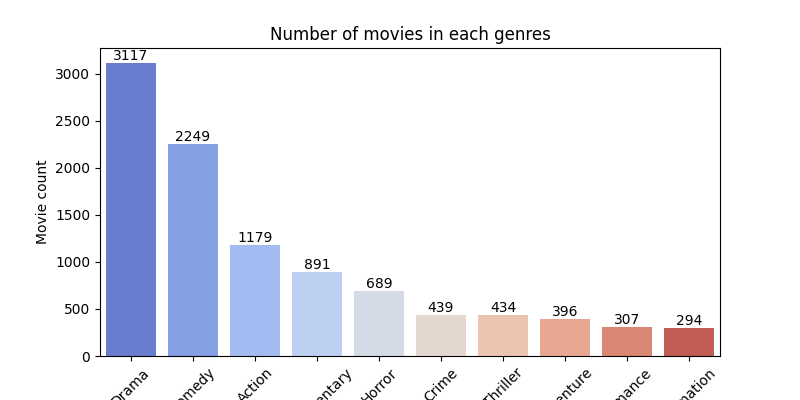
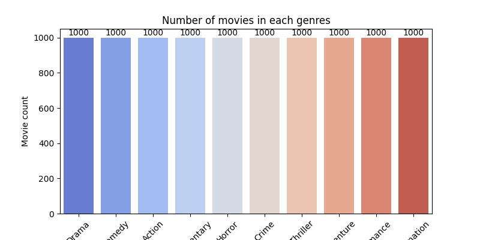

# Data

## Convertion 

This folder contains code for converting and cleaning the original data. The original data is a .csv file with approximately 45 000 movies from:

[https://www.kaggle.com/datasets/rounakbanik/the-movies-dataset?resource=download](https://www.kaggle.com/datasets/rounakbanik/the-movies-dataset?resource=download). 

Instead of saving all genres in one column, the most relevant genre is used. Then the data is saved as a json-file, (movies.json)[movies.json]. 

## Cleaning
The data is cleaned and only movies within the most used genres is used. Movies without genres are removed. 

Two different datasets are created:
- [movies_balanced.json](movies_balanced.json): A balanced dataset with 1000 movies from each genre.
- [movies_stratified.json](movies_stratified.json): A stratified dataset with 9995 movies in total. The number of movies from each genre is proportional to the number of movies in the original dataset.

## Visualization
The distribution of genres in the original dataset, the stratified dataset and the balanced dataset is shown below. 

### Stratified dataset

### Balanced dataset

